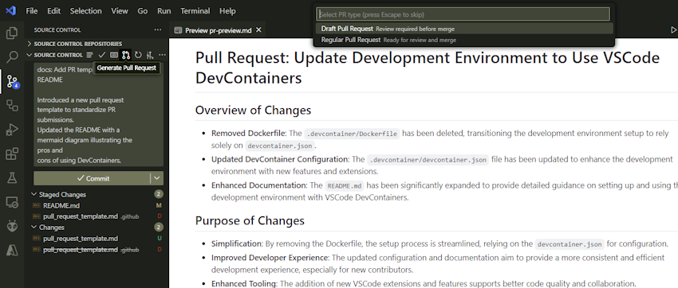
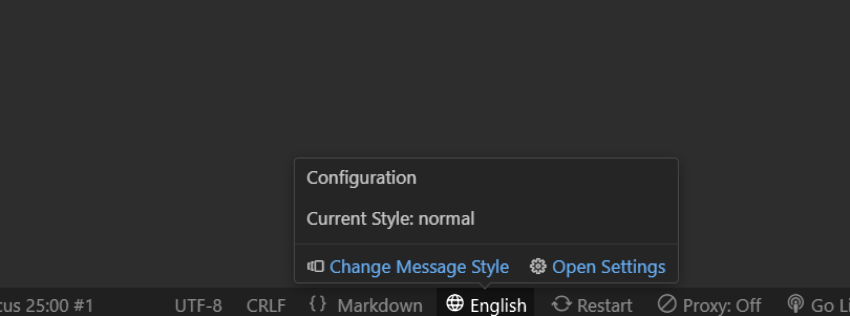
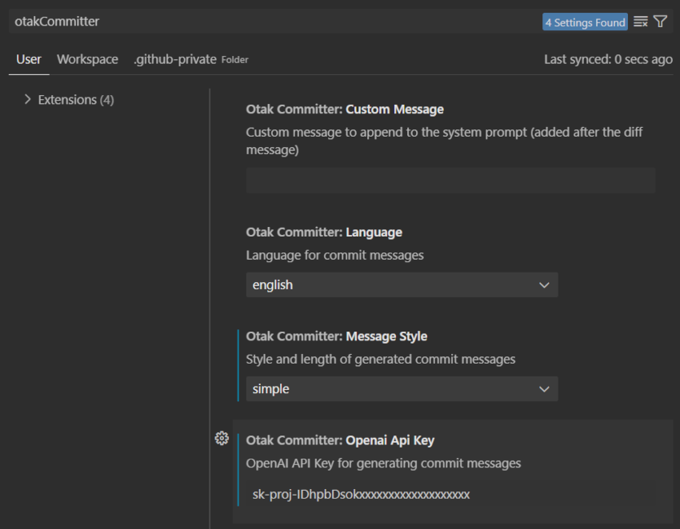

<p align="center">
  <h1 align="center">otak-committer</h1>
  <p align="center">
    VS Code extension for intelligent SCM operations - Multilingual commit message generation with AI support (supporting 25 languages) and future PR management features.
  </p>
</p>

---

## Usage

For Commit Message:


1. Stage your changes in Git  
2. Click the "Generate Commit Message" button in the SCM view (or use the command palette)  
3. Review and optionally edit the generated message  
4. The extension will:
   - Check for commit message templates in the following locations:
     - `.gitmessage`
     - `.github/commit_template`
     - `.github/templates/commit_template.md`
     - `docs/templates/commit_template.md`
   - If multiple templates exist, the first found template will be used
     (in the order listed above)
   - If found, use these templates as the base structure for the message
   - Generate content following your project's commit conventions
5. Commit your changes

For Pull Requests:



1. Click the "Generate Pull Request" button in the SCM view
 or use the command palette (`otak-committer.generatePR`)
2. Link to an existing issue:
   - Select from a list of open issues in your repository
   - The selected issue's title and description will be used as context for PR generation
   - The extension checks for PR templates in:
     - `.github/pull_request_template.md`
     - `.github/templates/pull_request_template.md`
     - `docs/templates/pull_request_template.md`
   - If a template is found:
     - It will be used as the base structure
 for the PR
     - AI will intelligently fill in each section based on your changes and the linked issue
   - Issue labels and milestones will be automatically applied to the PR
3. Select base and target branches:
   - Choose the branch you want to merge into (base)
   - Choose your feature branch (target)
4. Review and customize the generated content:
   - AI generates a PR description based on your changes and linked issue
   - Reference any related issues or documentation
   - Choose between Draft or Regular PR
5. Submit your pull request:
   - Confirm the settings and submit
   - The PR will be created with the linked issue reference

*Note*: Make sure you have configured your GitHub token with `repo` scope to enable issue linking and PR creation features.

For Issue


## Features

otak-committer is a powerful VS Code extension that leverages AI to automatically generate Git commit messages and pull requests.

### Key Features

- **Multilingual Support**: Generate commit messages in 25 languages:
  - 🇺🇸 English
  - 🇫🇷 Français
  - 🇩🇪 Deutsch
  - 🇮🇹 Italiano
  - 🇪🇸 Español
  - 🇵🇹 Português
  - 🇨🇿 Čeština
  - 🇭🇺 Magyar
  - 🇧🇬 Български
  - 🇹🇷 Türkçe
  - 🇵🇱 Polski
  - 🇷🇺 Русский
  - 🇯🇵 日本語
  - 🇨🇳 中文
  - 🇹🇼 繁體中文
  - 🇰🇷 한국어
  - 🇻🇳 Tiếng Việt
  - 🇹🇭 ไทย
  - 🇮🇳 हिन्दी
  - 🇧🇩 বাংলা
  - 🇮🇩 Basa Jawa
  - 🇮🇳 தமிழ்
  - 🇲🇲 မြန်မာဘာသာ
  - 🇦🇪 العربية
  - 🇮🇱 עברית

- **Flexible Message Styles**: Choose from three levels of detail for your commit messages:
  - **Simple**: Concise summary (100 tokens)
  - **Normal**: Standard length with context (200 tokens)
  - **Detailed**: Comprehensive explanation (500 tokens)

- **Git SCM Integration**: Seamlessly integrated into VS Code's Git interface with dedicated buttons in the SCM view.

- **Quick Language Switching**: Change languages directly from the status bar  
  
  - One-click language switching
  - Current message style display in tooltip
  - Quick access to settings

- **Pull Request Generation**
  - AI-powered PR description generation
  - Automatic issue linking
  - Branch selection interface
  - Preview and confirmation workflow
  - Draft/Regular PR options

- **Custom System Prompt**: Add your own instructions to the AI
  - Customize the message generation process
  - Add specific requirements or guidelines
  - Configure via `otakCommitter.customMessage` setting  
  - Examples of custom messages:
    ```
    Please include JIRA ticket number [PROJ-123] at the start of the commit message
    Add a link to the related documentation at the end of the message
    Always mention performance impact for any code changes
    ```
  *Note*: Custom messages are appended to the Git diff before processing, allowing you to provide additional context or requirements without overriding the core commit message generation logic.

## Requirements

- Visual Studio Code ^1.90.0
- Git installed and configured
- OpenAI API key

### Getting OpenAI API Key

To use this extension, you need an OpenAI API key. Here's how to get one:

1. Go to [OpenAI API Keys page](https://platform.openai.com/api-keys)
2. Sign in or create an OpenAI account
3. Create a new API key
4. Copy the API key
5. Open VS Code Settings (File > Preferences > Settings)
6. Search for `otakCommitter.openaiApiKey`
7. Paste your API key into the text field

*Note*: The extension uses the GPT-4o model to generate commit messages. Make sure your OpenAI account has access to the GPT-4o API.

### Getting GitHub Access Token

For pull request operations, you'll need a GitHub personal access token. Here's how to get one:

1. Go to [GitHub Personal Access Tokens page](https://github.com/settings/tokens)
2. Click "Generate new token" and select "Generate new token (classic)"
3. Give your token a descriptive name (e.g., "otak-committer")
4. Select only the `repo` scope (required for creating pull requests and accessing issues)
5. Click "Generate token"
6. Copy the generated token
7. Open VS Code Settings (File > Preferences > Settings)
8. Search for `otakCommitter.github.token`
9. Paste your token into the text field

*Note*: Store your token securely. Once you leave the token creation page, you won't be able to see it again.
*Note*: The `repo` scope is required to:
- Create and manage pull requests with automated descriptions
- Access and link to existing issues in your repositories
- Apply issue labels and milestones automatically to your PRs

## Installation

1. Install the extension from the VS Code Marketplace
2. Configure your OpenAI API key in the extension settings
3. The extension will automatically initialize and show in the status bar
4. Select your preferred language and message style  
   (Default language is English)

## Extension Settings

This extension contributes the following settings:



- **`otakCommitter.language`**: Language for commit messages (default: `"english"`).  
  The supported languages include:
  
  ```json
  "enum": [
      "english",
      "french",
      "german",
      "italian",
      "spanish",
      "portuguese",
      "czech",
      "hungarian",
      "bulgarian",
      "turkish",
      "polish",
      "russian",
      "japanese",
      "chinese",
      "traditionalChinese",
      "korean",
      "vietnamese",
      "thai",
      "hindi",
      "bengali",
      "javanese",
      "tamil",
      "burmese",
      "arabic",
      "hebrew"
  ],
  "enumDescriptions": [
      "English",
      "Français",
      "Deutsch",
      "Italiano",
      "Español",
      "Português",
      "Čeština",
      "Magyar",
      "Български",
      "Türkçe",
      "Polski",
      "Русский",
      "日本語",
      "中文",
      "繁體中文",
      "한국어",
      "Tiếng Việt",
      "ไทย",
      "हिन्दी",
      "বাংলা",
      "Basa Jawa",
      "தமிழ்",
      "မြန်မာဘာသာ",
      "العربية",
      "עברית"
  ]
  ```

- **`otakCommitter.messageStyle`**: Style and length of generated commit messages (default: `"normal"`).  
  Options include:
  - Simple (concise summary)
  - Normal (contextual details)
  - Detailed (comprehensive explanation)

- **`otakCommitter.openaiApiKey`**: OpenAI API key for generating commit messages.

- **`otakCommitter.github.token`**: GitHub personal access token for PR operations.

- **`otakCommitter.customMessage`**: Additional instructions for commit message generation (optional).  
  Enhance the AI's understanding of your commit requirements by appending custom instructions to the Git diff.  
  Example custom messages:
    ```
    # Project-specific conventions
    Always mention related component name in square brackets
    Include affected service names for backend changes

    # Team workflow requirements
    Add deployment notes if configuration files are modified
    Reference related test cases when fixing bugs
    ```

## Commands

- **`otak-committer.generateMessage`**: Generate a commit message for staged changes.
- **`otak-committer.generatePR`**: Generate a pull request with AI-powered description.
- **`otak-committer.openSettings`**: Open the extension settings.
- **`otak-committer.changeLanguage`**: Change commit message language (available in the status bar).
- **`otak-committer.changeMessageStyle`**: Change message style.

## Contributing

Contributions are welcome! Please feel free to submit a Pull Request. For major changes, please open an issue first to discuss what you would like to change.

## License

This project is licensed under the MIT License - see the LICENSE file for details.

---

For more information, visit the [GitHub repository](https://github.com/tsuyoshi-otake-system-exe-jp/otak-committer).